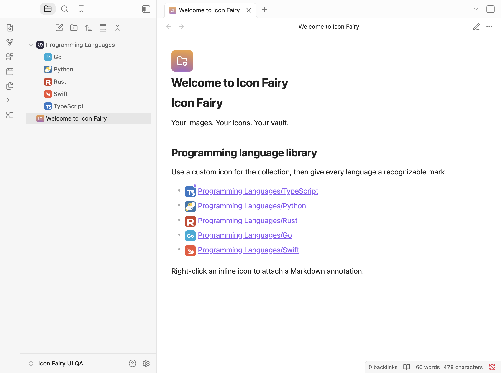
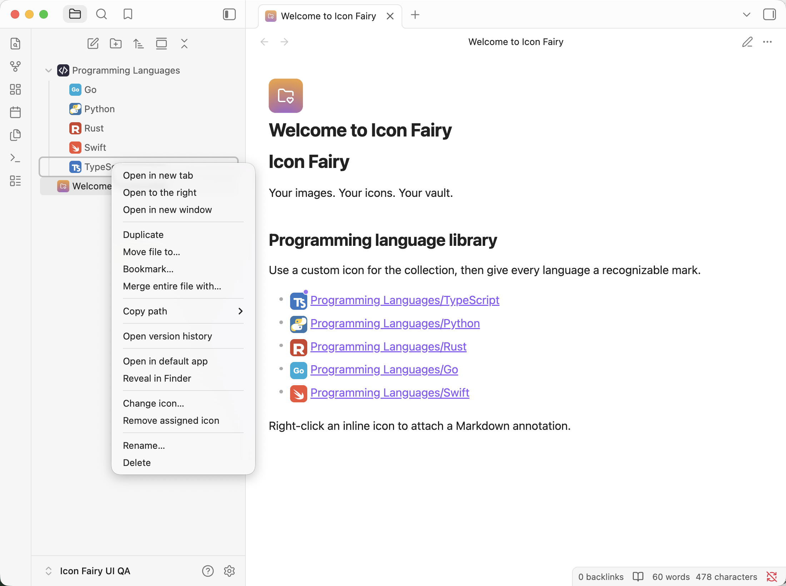
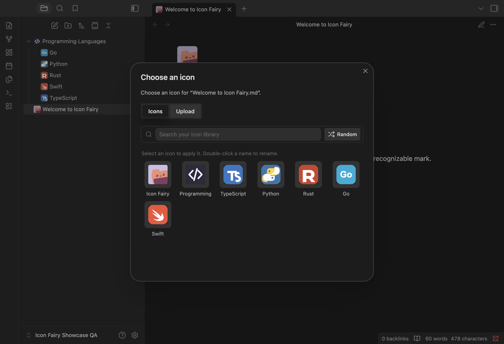
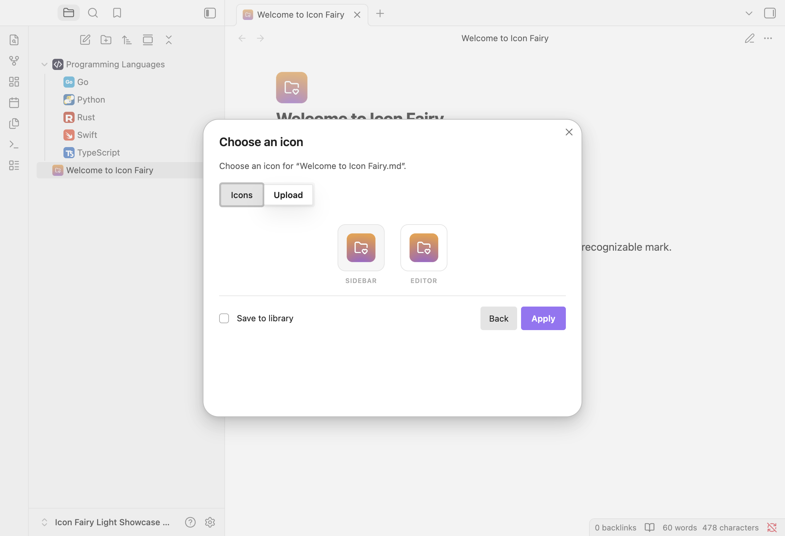
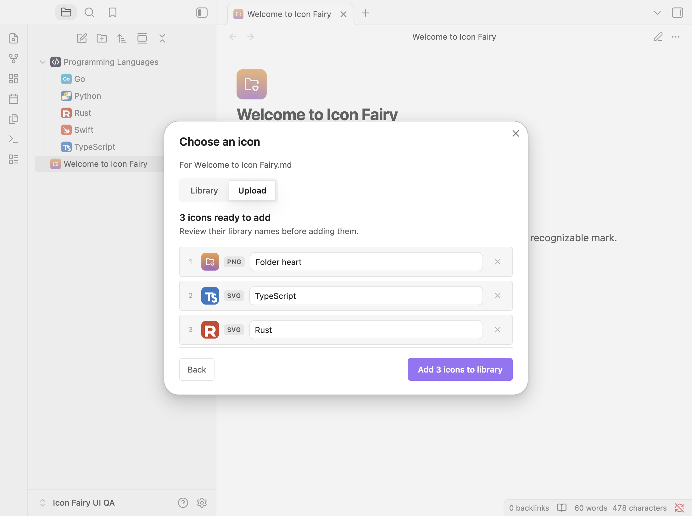
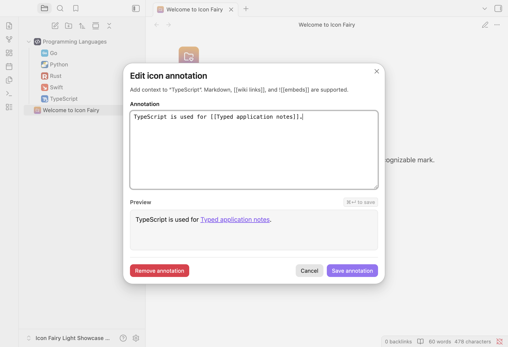
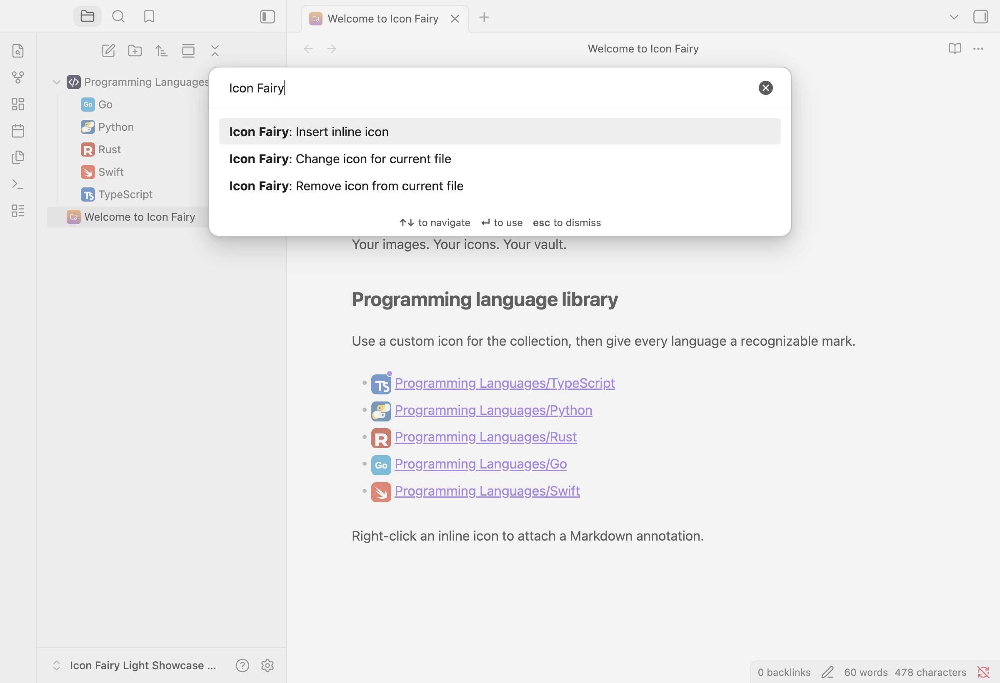
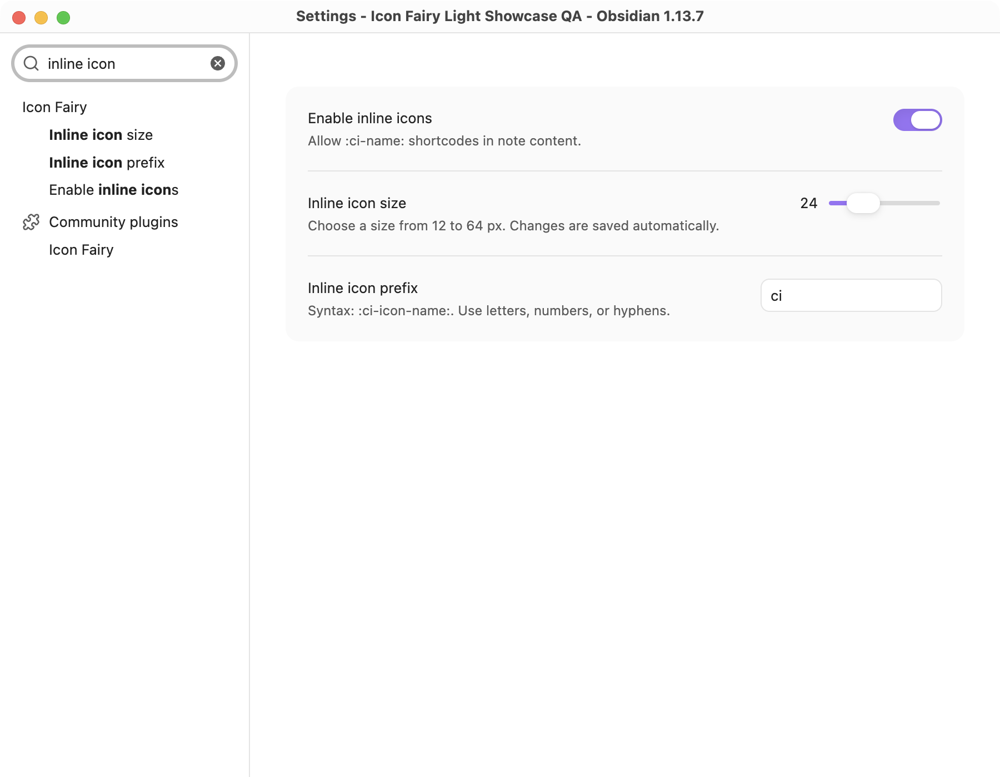
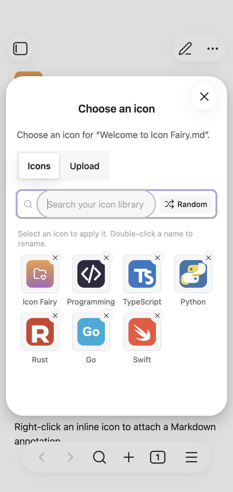

# Icon Fairy

<p align="center">
  
</p>

<p align="center"><strong>Your images. Your icons. Your vault.</strong></p>

<p align="center">
  <a href="https://github.com/t1seo/icon-fairy/actions/workflows/ci.yml"></a>
  <a href="https://github.com/t1seo/icon-fairy/releases/latest"></a>
  <a href="LICENSE"></a>
  <a href="README.ko.md"></a>
</p>

Upload your own PNG, JPG, WebP, or SVG images and use them as Obsidian icons for folders, notes, tabs, note titles, and inline text. Everything stays inside your vault.



## A two-minute tour

1. Right-click a file or folder and choose **Change icon…**.
2. Pick an icon already in your library, or open **Upload**.
3. The same assignment appears in the file explorer, tab, and note title.
4. Enable inline icons and write a shortcode such as `:ci-typescript:` inside a note.

| What you can do | Where it appears |
| --- | --- |
| Assign an icon to a folder | File explorer |
| Assign an icon to a note | File explorer, tab, and note title |
| Insert `:ci-NAME:` | Live Preview and Reading view |
| Annotate one inline icon | Accent dot and Markdown hover card |

<p align="center">
  
  
</p>

The picker names the current task and target, so it is always clear where the next icon will go. Search by name, choose **Random** for a quick pick, or use the keyboard: `Left`/`Right` changes the source tab, and arrow keys plus `Enter` select a focused icon. Icon Fairy keeps only one picker open at a time.

## Example: a programming language library

The included [sample vault](examples/programming-languages-vault) uses one icon for the collection and a familiar mark for every language:

```text
Programming Languages/       </> folder icon
├── TypeScript.md             TS icon
├── Python.md                 Python icon
├── Rust.md                   R icon
├── Go.md                     Go icon
└── Swift.md                  Swift icon
```

Each language note also uses its icon inline:

```md
# TypeScript

:ci-typescript: Type-safe JavaScript for large applications.
```

This makes a large vault easier to scan without changing file names or frontmatter.

## Upload and manage icons

Open the picker from a file menu or command, then choose **Upload**. Drop files into the upload area, choose **Browse files**, or paste an image from the clipboard. The drop zone is also available by keyboard with `Tab`, then `Enter` or `Space`.



Select multiple files to review, rename, or remove individual items before one batch import. SVG files remain vector files instead of being rasterized.



In the **Icons** tab, double-click a label to rename an icon. Use the remove button to delete it; assignments using that library item are cleared as well.

## Inline icons and annotations

Enable inline icons in the plugin settings, then type `:ci-` to open autocomplete or use the command palette. The default format is:

```text
:ci-ICON-ID:
```

Right-click a rendered inline icon and choose **Add icon annotation** or **Edit icon annotation**. The focused editor supports Markdown, `[[wiki links]]`, and `![[embeds]]`, with a live preview and `Cmd/Ctrl+Enter` to save. Annotated icons show a small accent dot.



Annotations are per occurrence. Icon Fairy adds an instance suffix such as `:ci-typescript~note-a1b2c3d4:` so two uses of the same icon can carry different notes.

## Commands

Open the command palette with `Cmd/Ctrl+P` and search for **Icon Fairy**:

- **Insert inline icon**
- **Change icon for current file**
- **Remove icon from current file**



## Settings



| Setting | Purpose | Default |
| --- | --- | --- |
| Enable inline icons | Render `:ci-NAME:` shortcodes | Off |
| Inline icon size | Set inline icons from 12 to 64 px; saves as you move the slider | 20 px |
| Inline icon prefix | Replace `ci` with your own prefix; saves when the field changes | `ci` |

## Desktop and mobile

The explorer icons, inline icons, annotations, commands, and picker adapt to Obsidian's desktop and mobile layouts. The mobile view below was captured from the sample vault with Obsidian's official desktop mobile emulation enabled.



## Installation

### Obsidian Community Plugins

Icon Fairy 3.0.0 uses plugin ID `icon-fairy` and repository `t1seo/icon-fairy`, and requires **Obsidian 1.5.7+**. The [Community listing](https://community.obsidian.md/plugins/icon-fairy) is public and its automated review passed with zero errors and warnings. As of September 13, 2026, 10:39 UTC, the in-app catalog is still synchronizing; use manual installation below until **Icon Fairy** appears:

1. Open **Settings → Community plugins → Browse**.
2. Search for **Icon Fairy**.
3. Select **Install**, then **Enable**.

### BRAT

1. Install and enable [BRAT](https://obsidian.md/plugins?id=obsidian42-brat).
2. Run **BRAT: Add a beta plugin for testing**.
3. Enter `https://github.com/t1seo/icon-fairy`.
4. Enable **Icon Fairy** in **Settings → Community plugins**.

### Manual installation

1. Download `main.js`, `manifest.json`, and `styles.css` from the [latest release](https://github.com/t1seo/icon-fairy/releases/latest).
2. Put them in `<vault>/.obsidian/plugins/icon-fairy/`.
3. Reload Obsidian and enable **Icon Fairy**.

Version 3.0.0 is a separate installation from both [Folder Fairy 2.x](https://github.com/t1seo/icon-studio) (`icon-studio`) and [Custom Icon / Icon Studio 1.x](https://github.com/t1seo/obsidian-icon-studio) (`custom-icon`). Icon Fairy is the same maintainer’s successor; both previous repositories and their releases remain available. Existing data, BRAT subscriptions, and hotkeys do not transfer automatically. To keep your icons, assignments, settings, and annotations, follow the [migration guide](docs/MIGRATING.md) using exactly one previous installation as the source. The `:ci-...:` note syntax stays the same.

## Sample vault

The repository includes [examples/programming-languages-vault](examples/programming-languages-vault), the exact structure used for the screenshots. Copy the three release files into its `.obsidian/plugins/icon-fairy/` directory, then open that folder as an Obsidian vault. See [the sample guide](docs/SAMPLE-VAULT.md) for details.

## Privacy and storage

Icon Fairy makes no network requests and has no runtime dependencies. Imported icons, assignments, settings, and annotations are stored locally under your vault's `.obsidian/plugins/icon-fairy/` directory.

## Development and release

```sh
npm ci
npm run verify
```

See [QA evidence](docs/QA.md), [UX/UI research and design decisions](docs/research/ux-ui-design.md), [release instructions](docs/RELEASING.md), [GitHub feedback and deployment diagnosis](docs/research/github-feedback.md), and [Community directory research](docs/research/obsidian-community-release.md).

## Support

Please [open an issue](https://github.com/t1seo/icon-fairy/issues) for bugs or feature requests.

[](https://www.buymeacoffee.com/taewonseo)

## License

[MIT](LICENSE)
